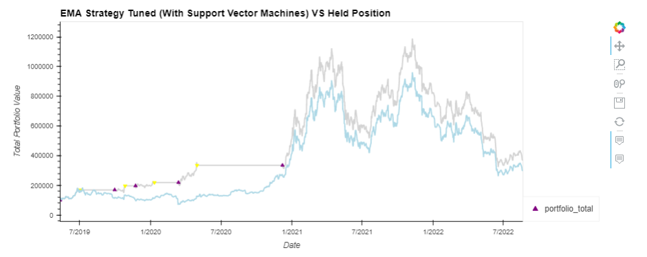
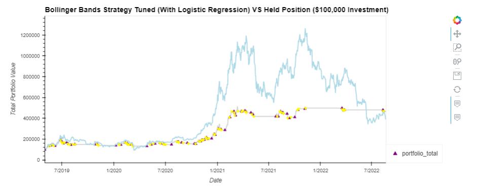

# Bitcoin-Algo-Bot

### This is group project created to demonstrate how machine learning can be implemented with common trading strategies and compare the outcomes of modelling them on Bitcoin.

## Resources and Libraries

Alpaca API - Five years of historic data was extracted  - This was then filtered  and cleaned to suit our models and saved to a CSV file.
Libraries include- Pandas.Numpy.Holoviews.Plotly.Seaborn.Sklearn.Finta
We also incorporated Facebook Prophet.

## Models and reference.

### Baseline
As a baseline comparison to test our models against we chose a fixed investment of $100,000 Bitcoin purchased at the start of of our dataset which is August 2017.
At that time the price was approx. $4000.00  and at the end of the dataset August 2022 it was approx $21,500, better than 5x its original value.

### Strategy 1
The first of our models used an Exponential Moving Average with Support Vector Machines to trade with. The signals to buy and sell are based on simple moving average crossover and the entire portfolio was traded in each transaction.
The final windows chosen for this EMA were 7 days in short and 80 days long.
*  Extensive testing was done on this model, both with and without the addition of machine learning, particularly with regard to window sizes. Ultimately the chosen parameters worked the best and showed a promising outcome.

### Strategy 2
The second of our models used Bolinger Bands and Logistic Regression to trade with. The signals to trade were based on Triple Exponential Moving Average and a standard deviations of 1.2. The entire portfolio was traded in each transaction here also.
*  This model received the works when in its design phase. It was tested with different moving average designs, different standard deviations and no less than 7 machine learning variations in a multitude of combinations. This model was tested with and without machine learning
This model also showed a promising outcome.

## Summary of findings

For the Machine Learning models we decided on approximately 18 months testing for two reasons. Primarily because it was approximately one third of the data set but critically because it incorporated a diverse range of market movement to test on.

This project is developing potential trading strategies for Bitcoin, as such we accepted that we were dealing with a highly volatile asset. Risk analysis in this instance is somewhat conditional, however each strategy had mitigating factors to the overall risk and demonstrated different levels of volatility 

*  EMA as a technical indicator
Smooths out volatility by averaging the price of security over a certain period
Helps identify momentum of security price

*  *  One of the recognised downsides to EMA is that it is a 
Lagging Indicator. In other words it is reactive rather than predictive, however in our use of machine learning in this instance, that doesnt seem to have been an issue.

*  BB as a technical indicator is effective in range bound markets, it helps identify breakouts based on volatility contractions.
Triple EMA reduces lag and the effects of volatility further than the standard EMA BB model. 

* *   In strongly trending markets, it might be at risk of being on the wrong side of a move. In this example it appeared to work quite well.

## Both models showed an improvement over the benchmark Fixed Investment strategy

### EMA Strategy 1
Exponential Moving Average: Strategy 1 Finished testing period 23.7% above the benchmark held position.

### BB Strategy 2
Bolinger Bands: Stategy 2
Finished testing period 17.1 % above the benchmark held position.

## Project team

Owen Harris

Orlando Sagrillo-Yeaman

Asan Yusuf

Ganesh Bashyal

Garry Comber
